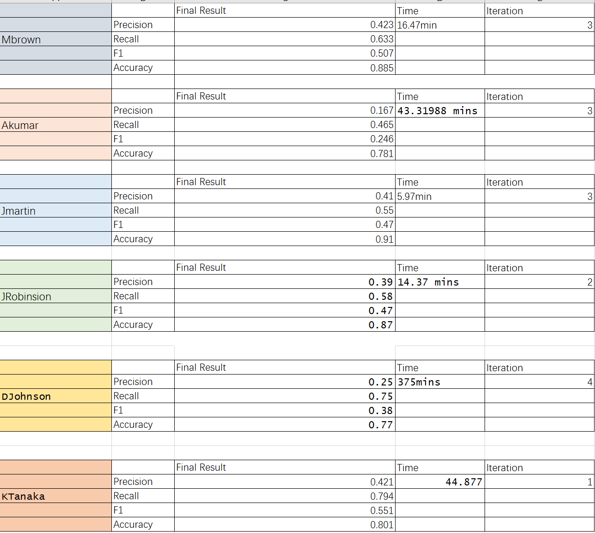
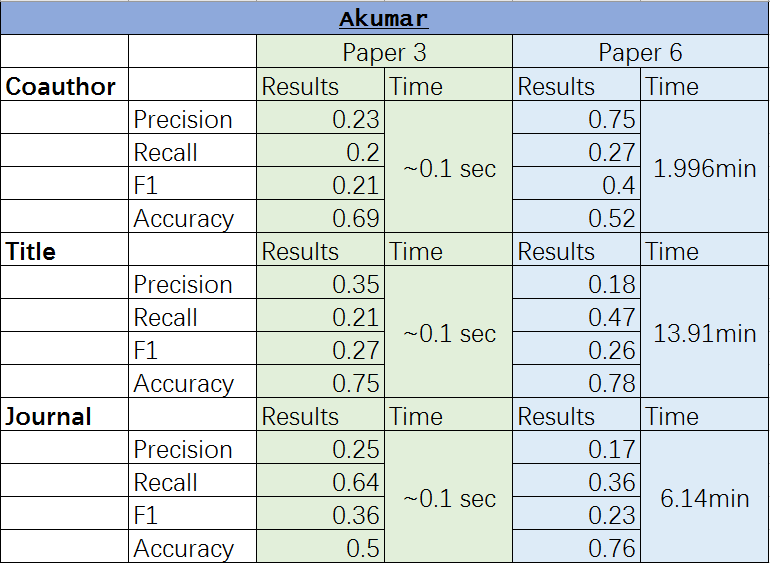
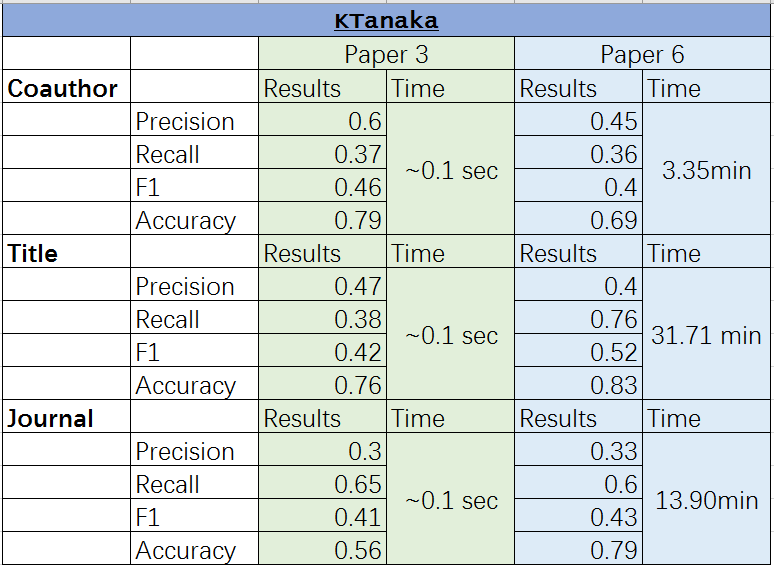
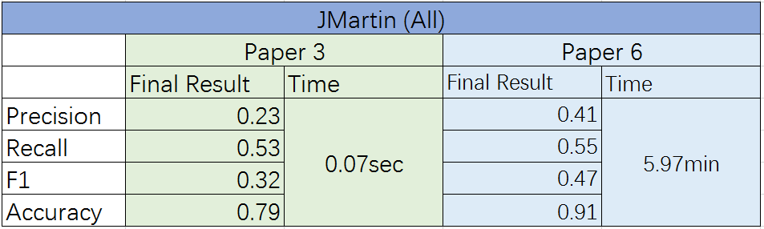
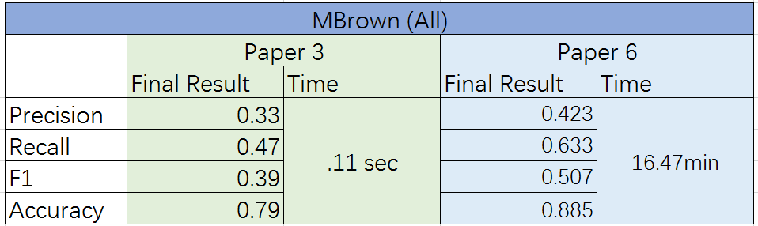
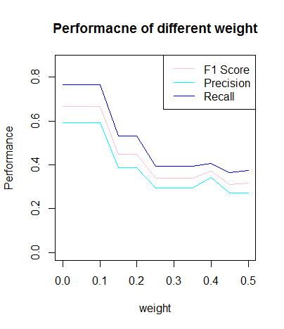
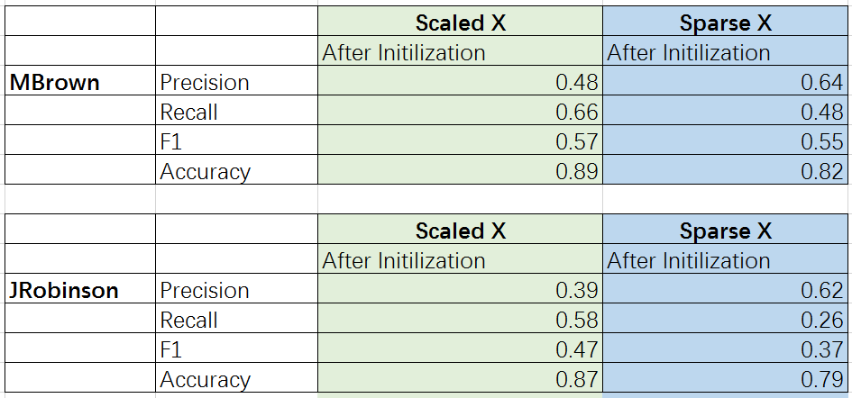
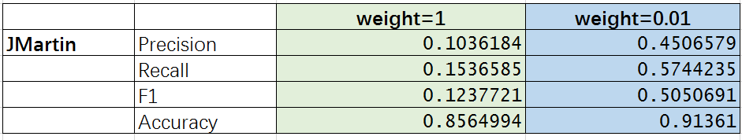

#ABSTRACT

In this project, our team was assigned two papers (Paper 3 and Paper 6) that proposed two algorithms concerning name disambiguation and we implemented these two algorithms in R code and we have also proposed evaluation methods to compare these algorithms. Generally, Paper 3 discussed the Spectral Clustering using QR decomposition and Paper 6 proposed a constraint-Based Probabilistic Framework. For evaluation, we compared the two methods based on the results from the Confusion Matrix and the running time.In this file, we will present our data reading, preprocessing, algorithm implements as well as evaluation results. Also, further discussion for Paper 6 will also be included. 


## Step 0: Load the packages, specify directories

```{r}
##########################################################################################################
# Here replace it with your own path or manually set it in RStudio to the lib folder                     #
setwd("D:/Columbia University/Spring2017-Applied Data Science/Project_4_Bz2290/Spr2017-proj4-team13/lib")
##########################################################################################################

#Relevant packages
list.of.packages = c("expm","pacman","text2vec","stringr")

new.packages <- list.of.packages[!(list.of.packages %in% installed.packages()[,"Package"])]

if(length(new.packages))
{
  install.packages(new.packages)
}

library("expm")
library("pacman")
library("text2vec")
library("stringr")
```

## Step 1: Load and process the data

For each record in the dataset, there are some information we want to extract and store: canonical author id, coauthors, paper title, publication venue title. 
In our main.rmd file, you will find our programs for input of each data file which have been proprocessed by our functions stored in "dataclean.R" under the lib folder.

```{r}
#Preprocess our data files
source("../lib/dataclean.R")
#Read in our data files
source("../lib/dataInput.R")
```

## Step 2: Feature design

Following the section 3.1 in the paper, we want to use paper titles to design features for citations. As the notation used in the paper, we want to find a $m$-dimensional citation vector $\alpha_i$ for each citation $i$, $i=1,...,n$. In this dataset, $n=$ `r nrow(AKumar)`. We study "TF-IDF" (term frequency-inverse document frequency) as suggested in the paper.

TF-IDF is a numerical statistics that is intended to reflect how important a word is to a document in a collection or corpus. It is often used as a weighting factor in information retrieval, text mining, and user modeling. The TF-IDF value increases proportionally to the number of times a word appears in the document, but is offset by the frequency of the word in the corpus, which helps to adjust for the fact that some words appear more frequently in general.

$$
\begin{aligned}
\mbox{TF}(t) &=\frac{\mbox{Number of times term $t$ appears in a document}}{\mbox{Total number of terms in the document}}\\
\mbox{IDF}(t) &=\log{\frac{\mbox{Total number of documents}}{\mbox{Number of documents with term $t$ in it}}}\\
\mbox{TF-IDF}(t) &=\mbox{TF}(t)\times\mbox{IDF}(t)
\end{aligned}
$$

## For Paper 3:

Construct our feature design for paper 3 with resepct to Coauthor, Title and Journal

```{r}
source("../lib/paper3/TFIDF_FeatureDesign.R")
#For paper 3
author_name <- list(AGupta,AKumar,CChen,DJohnson,JLee,JMartin,JRobinson,
                    JSmith,KTanaka,MBrown,MJones,MMiller,SLee,YChen)
coauthor <- list()
paper <- list()
journal <- list()
for(i in 1:14){
  coauthor[[i]] <- Create_Coauthor(author_name[[i]])
  paper[[i]] <- Create_Title(author_name[[i]])
  journal[[i]] <- Create_Journal(author_name[[i]])
  
}
```

**For Paper 6:**

Firstly, source functions and read data:

```{r,warning=FALSE}
######Preparetion,Data Loading and Preliminary Analysis######
folder.path="../data/namecsv/"

##Sourse all functions:
functions=list.files(path = "../lib/paper6",pattern = "*.[Rr]")
for(i in 1:length(functions)){
  source(paste("../lib/paper6/",functions[i],sep=""))
}

#Get all files and load them 
authores=list.files(path = folder.path, pattern = "*.csv")
authores<-substr(authores, start=1, stop=nchar(authores)-4)

rawdata<-as.list(1:length(authores))
names(rawdata)<-authores

for (i in authores){
   rawdata[[i]]<-read.csv(paste(folder.path,i,".csv",sep = ""),header = T,as.is=T)
}

##change the raw data to matrixes:
X_all<-lapply(rawdata,Create_X)
```

Then we can choose the interested author:

```{r}
##chosen is the user-specified data set name
chosen<-"MBrown"

data<-rawdata[[chosen]]
X<-X_all[[chosen]]
True_Author<-data$AuthorID
Split_coauthor<-split_coauthor(data)
```


## Step 3: Clustering

First of all, we perofrom the spectral cluster with QR decomposition on the data sets

```{r}
source("../lib/paper3/Spectral ClusterQR.R")

spec_coauthor <- list()
spec_title <- list()
spec_journal <- list()
for(i in 1:14){
  spec_coauthor[[i]] <- Spectral.Cluster(my.dat = coauthor[[i]],n.cluster = length(unique(author_name[[i]]$AuthorID)))
  spec_title[[i]] <- Spectral.Cluster(my.dat = paper[[i]],n.cluster = length(unique(author_name[[i]]$AuthorID)))
  spec_journal[[i]] <- Spectral.Cluster(my.dat = journal[[i]],n.cluster = length(unique(author_name[[i]]$AuthorID)))
}

```

Second of all, we implememnt the algorithm from paper 6 to analysis our data set.

```{r}
##If you want to rerun our algorithm,please set it as TRUE:
##Otherwise, we will load the pre-saved answers:
retrain<-F ##Basically for shorter time for kniting the pdf

####Get Constrian Matrix:
if (retrain){
  n<-nrow(X)
  Constraint<-matrix(NA,n,n)
  
  for(i in 1:n){
  Constraint[i,]<-sapply(1:n,constraint,paper2=i,Split_coauthor)
  }
  
  ##Initilization:
  answer<-initialization(data,X)

  ##EM Steps:
  cluster<-answer$cluster
  cluster2<-cluster
  A<-answer$A
  m=0

  a1<-Sys.time()
  while(any(cluster!=cluster2)|(m==0)){
    cluster<-cluster2
    M_step<-mstep(cluster=cluster,X=X,A=A,ita=0.01)
    A<-M_step$A
    centroids<-M_step$centroids
    m=m+1
  
    cluster2<-estep_fixed_clusters2(cluster=cluster,X=X,centroids=centroids,A=A)
    cluster2<-as.numeric(factor(cluster2))
    }
  a2<-Sys.time()
  cat("The training time is",a2-a1)
  cat("The iteration number is",m)
} 
```

## Step 4: Evaluation

The evaluation will be two fold, the first part of our evaluation will be base on the perfomrance of our model in paper 3 using different features(i.e. coauthor, paper, and jounral). We applied the evaluation based on the following methods:

Let $M$ be the set of machine-generated clusters, and $G$ the set of gold standard clusters. Then. in the table, for example, $a$ is the number of pairs of entities that are assigned to the same cluster in each of $M$ and $G$. Hence, $a$ and $d$ are interpreted as agreements, and $b$ and $c$ disagreements. When the table is considered as a confusion matrix for a two-class prediction problem, the standard "Precision", "Recall","F1", and "Accuracy" are defined as follows.

$$
\begin{aligned}
\mbox{Precision} &=\frac{a}{a+b}\\
\mbox{Recall}&=\frac{a}{a+c}\\
\mbox{F1} &=\frac{2\times\mbox{Precision}\times\mbox{Recall}}{\mbox{Precision}+\mbox{Recall}}\\
\mbox{Accuracy}&=\frac{a+d}{a+b+c+d}
\end{aligned}
$$

```{r}
source('../lib/evaluation_measures.R')

spec_eva <- function(author,result){
  matching <- matching_matrix(author$AuthorID,result)
  perform <- performance_statistics(matching)
  return(as.data.frame(perform))
}

eva_df <- data.frame()

for(i in 1:14){
  eva_df <- rbind(eva_df,spec_eva(author_name[[i]],spec_coauthor[[i]]))
  eva_df <- rbind(eva_df,spec_eva(author_name[[i]],spec_title[[i]]))
  eva_df <- rbind(eva_df,spec_eva(author_name[[i]],spec_journal[[i]]))
}


rownames(eva_df) <- c("AGupta_coauthor","AGupta_paper","AGupta_journal",
                      "AKumar_coauthor","AKumar_paper","AKumar_journal",
                      "CChen_coauthor","CChen_paper","CChen_journal",
                      "DJohnson_coauthor","DJohnson_paper","DJohnson_journal",
                      "JLee_coauthor","JLee_paper","JLee_journal",
                      "JMartin_coauthor","JMartin_paper","JMartin_journal",
                      "JRobinson_coauthor","JRobinson_paper","JRobinson_journal",
                      "JSmith_coauthor","JSmith_paper","JSmith_journal",
                      "KTanaka_coauthor","KTanaka_paper","KTanaka_journal",
                      "MBrown_coauthor","MBrown_paper","MBrown_journal",
                      "MJones_coauthor","MJones_paper","MJones_journal",
                      "MMiller_coauthor","MMiller_paper","MMiller_journal",
                      "SLee_coauthor","SLee_paper","SLee_journal",
                      "YChen_coauthor","YChen_paper","YChen_journal")
write.csv(eva_df, file = "../output/paper3/eva.csv")
```

```{r}
eva_df
```
Then we implement the code we written from paper 6 for the evaluation
```{r}
#answer_eva<-evalu(True_Author,cluster2)
```

####Paper 6 evaluation results:



Then we start to compare the two papers using same evaluation methods. Since we do not want to produce a length report, we only use some of the data set to demonstrate what we foud during the development of this project

First of all, we compare two algorithms using each of the three feautres(Coauthor, Paper, Journal) using AKumar data set:

####AKumar data set results:


From the above graph, we can observe that:

Then, we also compare the two algorithm using a different data set KTanaka:

####KTanaka data set results:


From the above graph, we can see that:

We also have compared the two algorithms using all features:

####JMartin data set results:


####MBrown data set results:


From the above two graphs, we can see that:

#Step 5 Further Observations of methods in paper 6

In addition to the above evaluation, we have also observed several interesting trends for algorithm introduced in paper 6 using c2 constraint.

####Interesting results cont'd:


From tuning the first 50 lines for author MBrown, we figured out that the smaller the weight, the better the result.Although we get this conclusion, there should still be further discussions about how to set weight value if we could do deeper optimization.


####Interesting results cont'd:

After carefully reading and discussing paper6, we first create an initial algorithm.
But the result does not have a high accuracy, then we found out that the problem may happens since the X matrix is too sparse. Considering the equation of updating each parameter amm in A, we scaled X matrix, to made the differentiating function more reliable. After this optimization, we finally found that we could get better result as we hope to.

####Interesting results cont'd:



Since we found that after EM algorithm, the accuracy does not approve a lot, then we found out that the problem may happens since we initial weight value as 1. Considering the larger the weight, the greater the impact of the constraint is, we reset the weight value to 0.01.


